# 系统设计
## 概述
基于fasttext的社交评论检测平台（下称“平台”）项目功能已经完全实现，目前平台以网站形式呈现，支持将视频下方对应的评论进行7类分析：积极、消极、中立、用户建议、用户提出的问题、点赞数高的评论、回复数多的评论。前三者通过饼图进行比例分析，后四者是通过罗列相关数据呈现。

平台最终以网站的形式呈现，后端基于Python实现。通过在前端页面输入Bilibili视频对应的url，发送向后端，后端对视频下方的评论进行爬取，然后将爬取到的数据进行分析处理后，最后将处理结果返还给前端，呈现给用户。平台整体技术栈主要如下图所示：

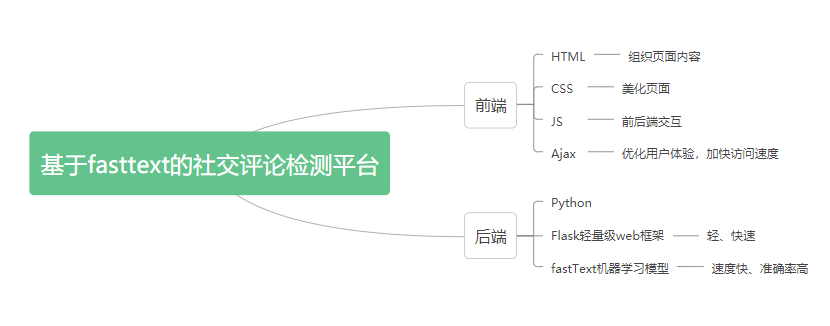

## 总体设计
平台目前主要实现的功能是按照积极、消极、中立、用户建议、用户提出的问题、点赞数高的评论、回复数多的评论这七类标准对评论进行分析分类，并以最简洁易懂的方式呈现给用户。综合两者需求，最终决定平台以网站的形式进行呈现，后端采用轻量级的Web 应用程序框架Flask，并用Python实现目的功能。平台总体事务处理逻辑如下图所示：

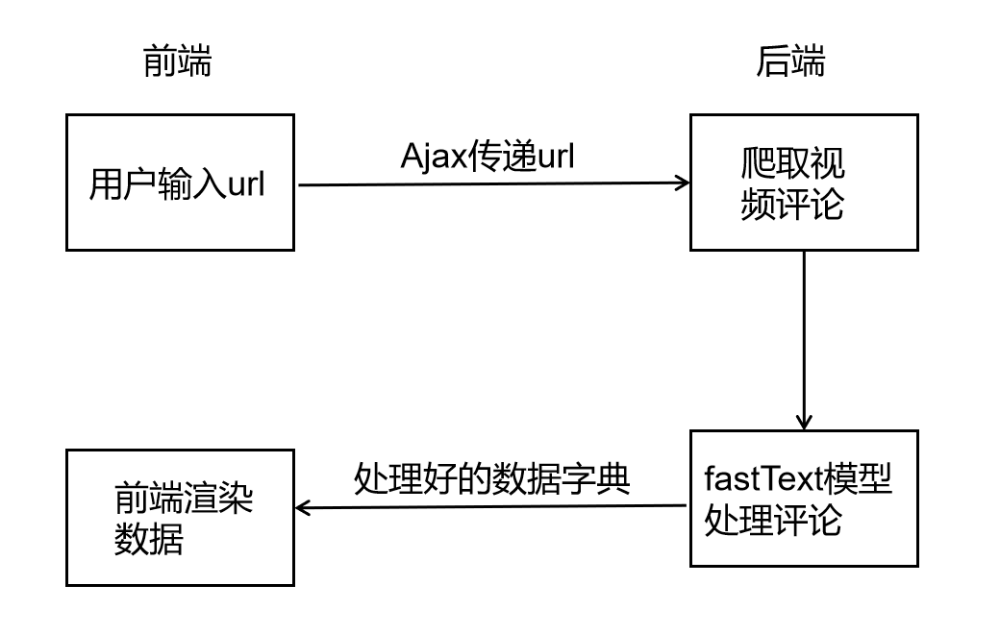

为了提高前端性能和速度、保持良好交互性能、异步调用和节省宽带等目的，前端使用了Ajax。后端在处理评论时主要使用的编程语言是Python，因此Web 应用程序框架选用了Flask，该框架具有易于使用扩展、轻量级和模块化设计等一系列优点。
平台核心功能为评论分析，对评论进行自然语言识别，基于此，我们选择采用的评论文本分类模型是Facebook于2016年开源的一个词向量计算和文本分类工具——fastText。fastText 模型输入一个词的序列（一段文本或者一句话)，输出这个词序列属于不同类别的概率，序列中的词和词组组成特征向量，特征向量通过线性变换映射到中间层，中间层再映射到标签。
具体而言，fastText模型只有三层：输入层、隐含层、输出层，输入都是多个经向量表示的单词，隐含层是对多个词向量的叠加平均，输出则是一个分类的label。

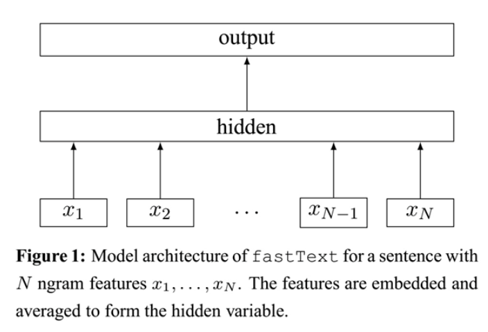

## 详细设计

**文件目录树：**

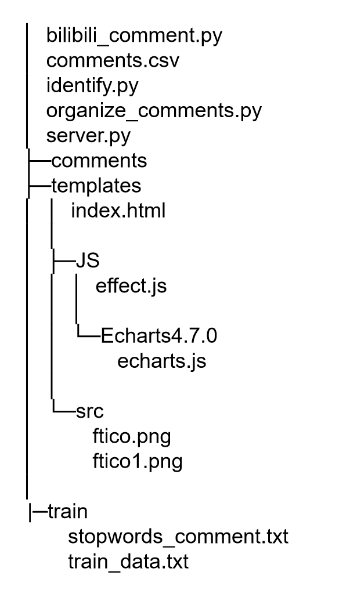

**项目具体运行流程图：**

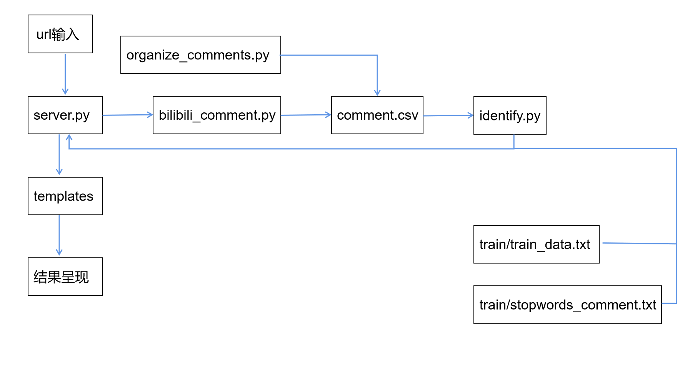

用户在web前端输入bilibili任意一个视频页面的url，server.py就会调用bilibili_comment.py来对视频下方的评论进行爬取，并调用organize_comments.py里定义的organize() 函数对爬取下的评论整理分类，最终形成comment.csv，效果如下：

其中表格列名分别为：ID号，昵称，评论内容，评论回复数，点赞数。紧接着，identify.py利用fastText模型并根据语库train_data.txt和停用词表stopwords_comment.txt对上一步处理好的comment.csv中的评论进行分析，形成如下字典：

**{"positive": , "negative": , "neutral": , "suggestion": [], "question": [], "high_praise": [],"more_reply": []}**

将该字典送入前端进行渲染，将最终结果呈现给用户。

**代码展示：**

server.py: 启动web服务

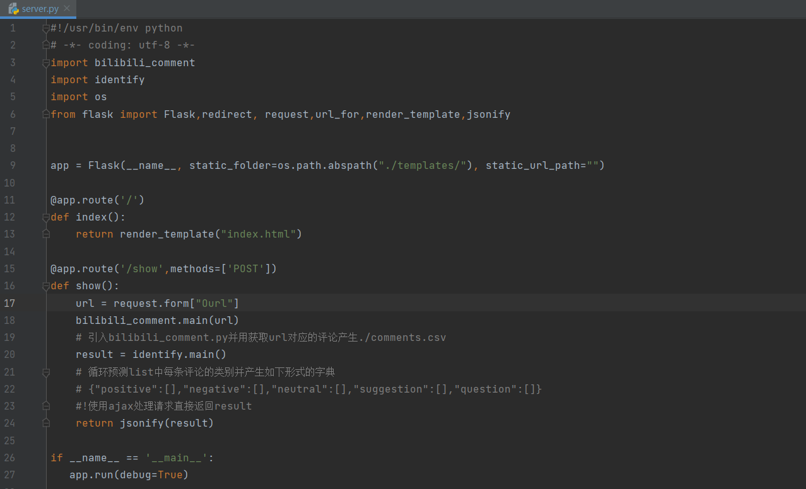

bilibili_comment.py: 爬取视频下方评论

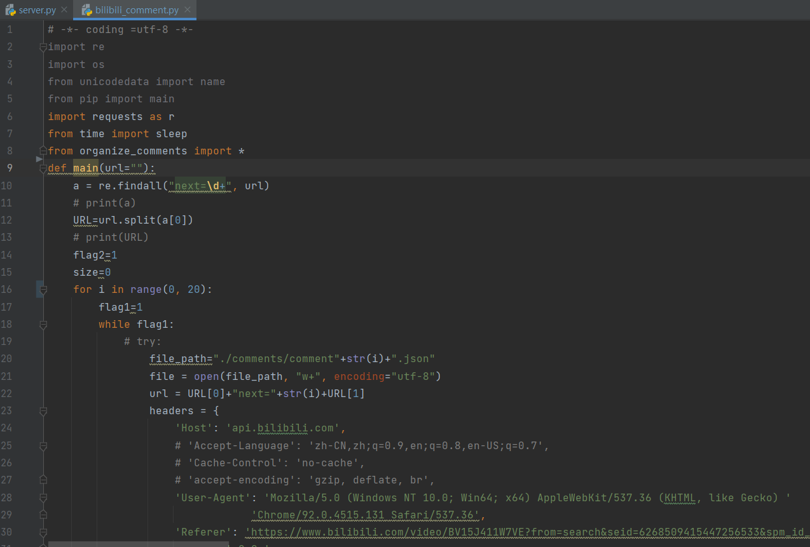

organize_comments.py: 对爬取下的评论组织整理

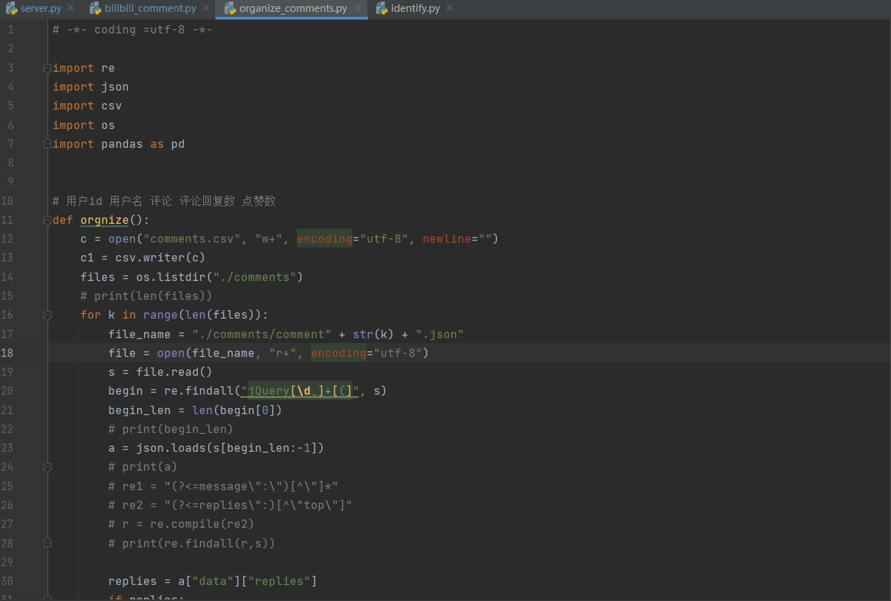

identity.py: 对整理好的评论进行机器学习分析

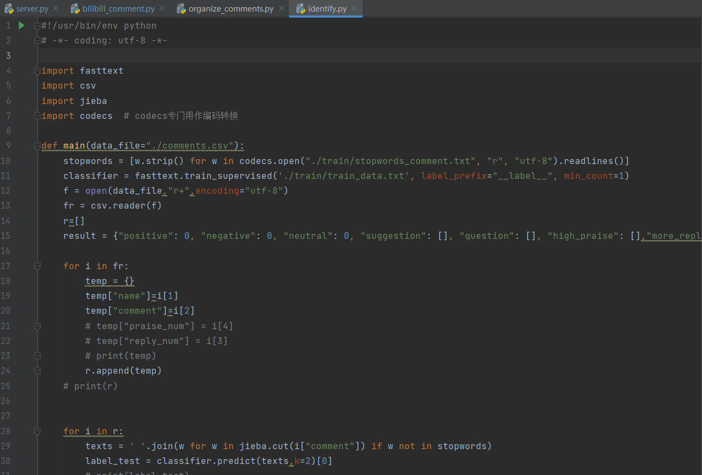

index.html: 前端渲染展示

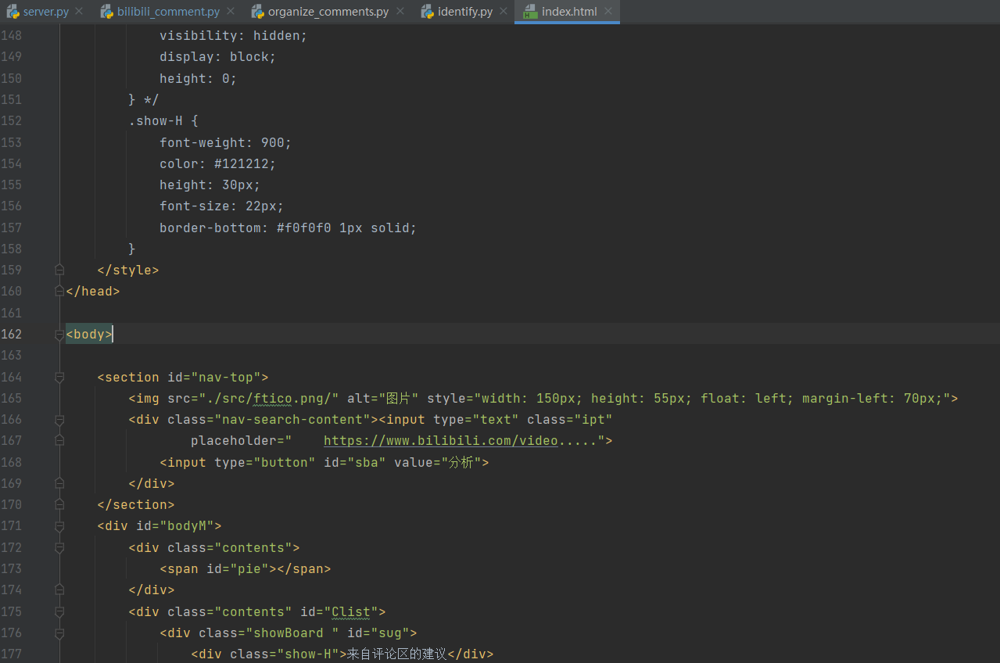

train_data.txt: 训练数据集

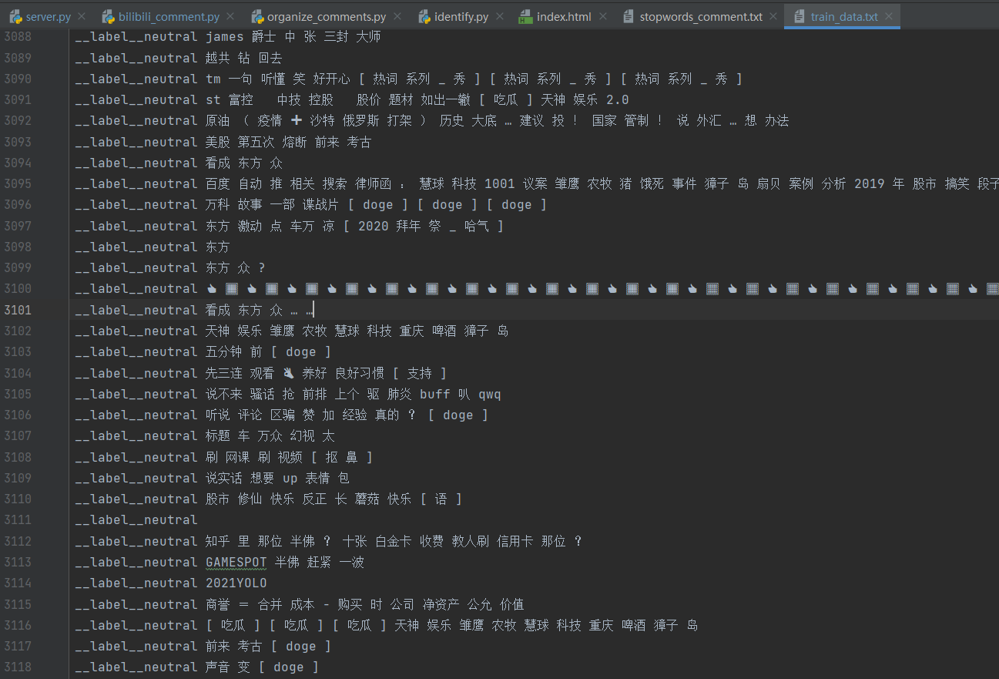

# 成果展示
运行server.py，开启本地5000端口

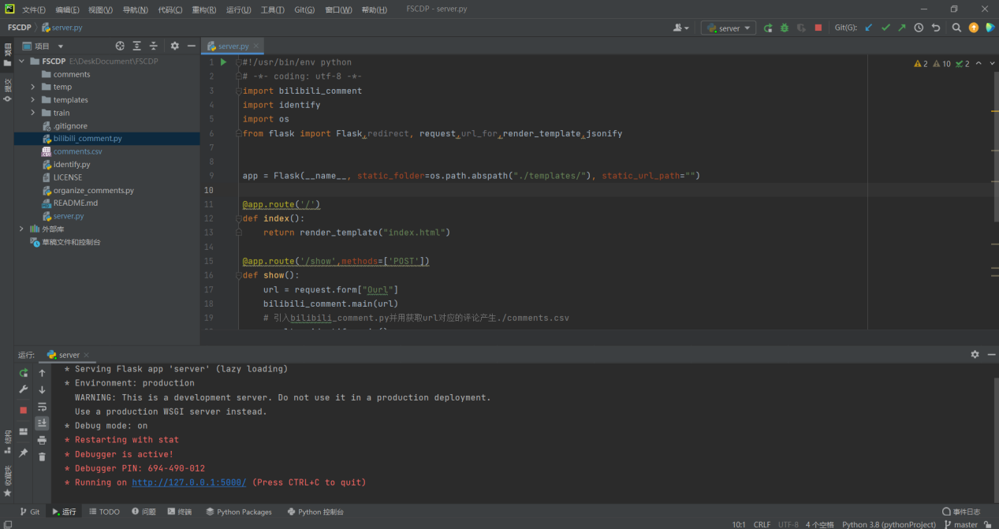

在浏览器里打开127.0.0.1:5000

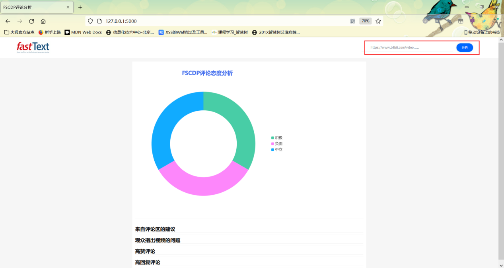

在输入框输入如下视频的url:

https://api.bilibili.com/x/v2/reply/main?callback=jQuery1720959189428257528_1641545094585&jsonp=jsonp&next=3&type=1&oid=337901625&mode=3&plat=1&_=164154528134

最终结果呈现：
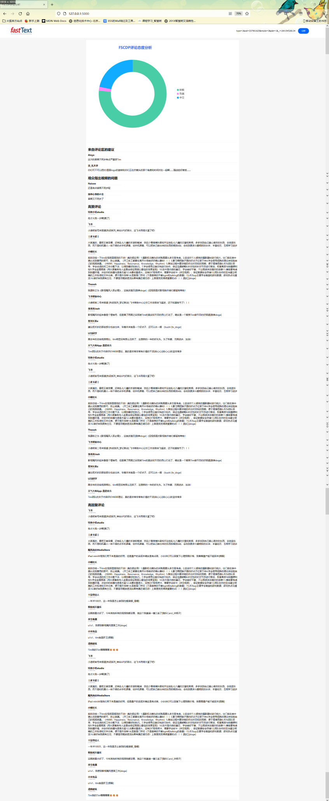